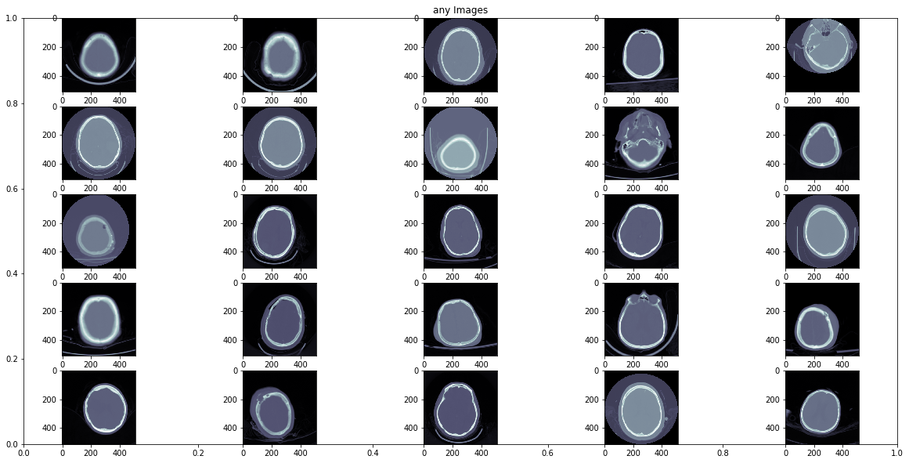

# RSNA Intracranial Hemorrhage Detection

# Overview

Intracranial hemorrhage, bleeding that occurs inside the cranium, is a serious health problem requiring rapid and often intensive medical treatment. For example, intracranial hemorrhages account for approximately 10% of strokes in the U.S., where stroke is the fifth-leading cause of death. Identifying the location and type of any hemorrhage present is a critical step in treating the patient.

Diagnosis requires an urgent procedure. When a patient shows acute neurological symptoms such as severe headache or loss of consciousness, highly trained specialists review medical images of the patient’s cranium to look for the presence, location and type of hemorrhage. The process is complicated and often time consuming.

# Hemorrhage Types

Hemorrhage in the head (intracranial hemorrhage) is a relatively common condition that has many causes ranging from trauma, stroke, aneurysm, vascular malformations, high blood pressure, illicit drugs and blood clotting disorders. The neurologic consequences also vary extensively depending upon the size, type of hemorrhage and location ranging from headache to death. The role of the Radiologist is to detect the hemorrhage, characterize the hemorrhage subtype, its size and to determine if the hemorrhage might be jeopardizing critical areas of the brain that might require immediate surgery.
While all acute (i.e. new) hemorrhages appear dense (i.e. white) on computed tomography (CT), the primary imaging features that help Radiologists determine the subtype of hemorrhage are the location, shape and proximity to other structures (see table).

Intraparenchymal hemorrhage is blood that is located completely within the brain itself; intraventricular or subarachnoid hemorrhage is blood that has leaked into the spaces of the brain that normally contain cerebrospinal fluid (the ventricles or subarachnoid cisterns). Extra-axial hemorrhages are blood that collects in the tissue coverings that surround the brain (e.g. subdural or epidural subtypes). ee figure.) Patients may exhibit more than one type of cerebral hemorrhage, which c may appear on the same image. While small hemorrhages are less morbid than large hemorrhages typically, even a small hemorrhage can lead to death because it is an indicator of another type of serious abnormality (e.g. cerebral aneurysm).

# Data Description

The training data is provided as a set of image Ids and multiple labels, one for each of five sub-types of hemorrhage, plus an additional label for any, which should always be true if any of the sub-type labels is true.
There is also a target column, Label, indicating the probability of whether that type of hemorrhage exists in the indicated image.
There will be 6 rows per image Id. The label indicated by a particular row will look like [Image Id]_[Sub-type Name], as follows:

Id,Label<br>
1_epidural_hemorrhage,0<br>
1_intraparenchymal_hemorrhage,0<br>
1_intraventricular_hemorrhage,0<br>
1_subarachnoid_hemorrhage,0.6<br>
1_subdural_hemorrhage,0<br>
1_any,0.9<br>

## DICOM Images

All provided images are in DICOM format. DICOM images contain associated metadata. This will include PatientID, StudyInstanceUID, SeriesInstanceUID, and other features. You will notice some PatientIDs represented in both the stage 1 train and test sets. This is known and intentional. However, there will be no crossover of PatientIDs into stage 2 test. Additionally, per the rules, “Submission predictions must be based entirely on the pixel data in the provided datasets.” Therefore, you should not expect to use or gain advantage by use of this crossover in stage 1.

**For this dataset we need to predict whether a hemorrhage exists in a given image, and what type it is.**

## Files

* stage_1_train.csv - the training set. Contains Ids and target information.
* stage_1_train_images
* stage_1_test_images

You can find the dataset [here](https://www.kaggle.com/c/rsna-intracranial-hemorrhage-detection/data).

## So let’s begin here…


```python
import numpy as np # linear algebra
import pandas as pd # data processing, CSV file I/O (e.g. pd.read_csv)
import seaborn as sns
import matplotlib.pyplot as plt
import scipy as sp
import os
```

## Load Data

```python
train_data = pd.read_csv('/kaggle/input/rsna-intracranial-hemorrhage-detection/stage_1_train.csv')
print(train_data.head(10))
```

                                  ID  Label
    0          ID_63eb1e259_epidural      0
    1  ID_63eb1e259_intraparenchymal      0
    2  ID_63eb1e259_intraventricular      0
    3      ID_63eb1e259_subarachnoid      0
    4          ID_63eb1e259_subdural      0
    5               ID_63eb1e259_any      0
    6          ID_2669954a7_epidural      0
    7  ID_2669954a7_intraparenchymal      0
    8  ID_2669954a7_intraventricular      0
    9      ID_2669954a7_subarachnoid      0
    

### Splitting Data

```python
splitData = train_data['ID'].str.split('_', expand = True)
train_data['class'] = splitData[2]
train_data['fileName'] = splitData[0] + '_' + splitData[1]
train_data = train_data.drop(columns=['ID'],axis=1)
del splitData
print(train_data.head(10))
```

       Label             class      fileName
    0      0          epidural  ID_63eb1e259
    1      0  intraparenchymal  ID_63eb1e259
    2      0  intraventricular  ID_63eb1e259
    3      0      subarachnoid  ID_63eb1e259
    4      0          subdural  ID_63eb1e259
    5      0               any  ID_63eb1e259
    6      0          epidural  ID_2669954a7
    7      0  intraparenchymal  ID_2669954a7
    8      0  intraventricular  ID_2669954a7
    9      0      subarachnoid  ID_2669954a7
    


```python
pivot_train_data = train_data[['Label', 'fileName', 'class']].drop_duplicates().pivot_table(index = 'fileName',columns=['class'], values='Label')
pivot_train_data = pd.DataFrame(pivot_train_data.to_records())
print(pivot_train_data.head(10))
```

           fileName  any  epidural  intraparenchymal  intraventricular  \
    0  ID_000039fa0    0         0                 0                 0   
    1  ID_00005679d    0         0                 0                 0   
    2  ID_00008ce3c    0         0                 0                 0   
    3  ID_0000950d7    0         0                 0                 0   
    4  ID_0000aee4b    0         0                 0                 0   
    5  ID_0000f1657    0         0                 0                 0   
    6  ID_000178e76    0         0                 0                 0   
    7  ID_00019828f    0         0                 0                 0   
    8  ID_0001dcc25    0         0                 0                 0   
    9  ID_0001de0e8    0         0                 0                 0   
    
       subarachnoid  subdural  
    0             0         0  
    1             0         0  
    2             0         0  
    3             0         0  
    4             0         0  
    5             0         0  
    6             0         0  
    7             0         0  
    8             0         0  
    9             0         0  
    

## Data Analysis


```python
import matplotlib.image as pltimg
import pydicom

fig = plt.figure(figsize = (20,10))
rows = 5
columns = 5
trainImages = os.listdir('/kaggle/input/rsna-intracranial-hemorrhage-detection/stage_1_train_images/')
for i in range(rows*columns):
    ds = pydicom.dcmread('/kaggle/input/rsna-intracranial-hemorrhage-detection/stage_1_train_images/' + trainImages[i*100+1])
    fig.add_subplot(rows, columns, i+1)
    plt.imshow(ds.pixel_array, cmap=plt.cm.bone)
    fig.add_subplot
```


```python
colsToPlot = ['any','epidural','intraparenchymal','intraventricular','subarachnoid','subdural']
rows = 5
columns = 5
for i_col in colsToPlot:
    fig = plt.figure(figsize = (20,10))
    trainImages = list(pivot_train_data.loc[pivot_train_data[i_col]==1,'fileName'])
    plt.title(i_col + ' Images')
    for i in range(rows*columns):
        ds = pydicom.dcmread('/kaggle/input/rsna-intracranial-hemorrhage-detection/stage_1_train_images/' + trainImages[i*100+1] +'.dcm')
        fig.add_subplot(rows, columns, i+1)
        plt.imshow(ds.pixel_array, cmap=plt.cm.bone)        
        fig.add_subplot
```





```python
for i_col in colsToPlot:
    plt.figure()
    ax = sns.countplot(pivot_train_data[i_col])
    ax.set_title(i_col + ' class count')
```


```python
# dropping of corrupted image from dataset
pivot_train_data = pivot_train_data.drop(list(pivot_train_data['fileName']).index('ID_6431af929'))
```

## Training Dataset


```python
import keras
from keras.layers import Dense, Activation,Dropout,Conv2D,MaxPooling2D,Flatten,Input,BatchNormalization,AveragePooling2D,LeakyReLU,ZeroPadding2D,Add
from keras.models import Sequential, Model
from keras.initializers import glorot_uniform
from tqdm import tqdm
from sklearn.model_selection import train_test_split
import cv2

pivot_train_data = pivot_train_data.sample(frac=1).reset_index(drop=True)
train_df,val_df = train_test_split(pivot_train_data,test_size = 0.03, random_state = 42)
batch_size = 64
```

    Using TensorFlow backend.
    


```python
y_train = train_df[['any','epidural','intraparenchymal','intraventricular','subarachnoid','subdural']]
y_val = val_df[['any','epidural','intraparenchymal','intraventricular','subarachnoid','subdural']]
train_files = list(train_df['fileName'])

def readDCMFile(fileName):
    ds = pydicom.read_file(fileName) # read dicom image
    img = ds.pixel_array # get image array
    img = cv2.resize(img, (64, 64), interpolation = cv2.INTER_AREA) 
    return img

def generateImageData(train_files,y_train):
    numBatches = int(np.ceil(len(train_files)/batch_size))
    while True:
        for i in range(numBatches):
            batchFiles = train_files[i*batch_size : (i+1)*batch_size]
            x_batch_data = np.array([readDCMFile('/kaggle/input/rsna-intracranial-hemorrhage-detection/stage_1_train_images/' + i_f +'.dcm') for i_f in tqdm(batchFiles)])
            y_batch_data = y_train[i*batch_size : (i+1)*batch_size]
            x_batch_data = np.reshape(x_batch_data,(x_batch_data.shape[0],x_batch_data.shape[1],x_batch_data.shape[2],1))            
            yield x_batch_data,y_batch_data
            
def generateTestImageData(test_files):
    numBatches = int(np.ceil(len(test_files)/batch_size))
    while True:
        for i in range(numBatches):
            batchFiles = test_files[i*batch_size : (i+1)*batch_size]
            x_batch_data = np.array([readDCMFile('/kaggle/input/rsna-intracranial-hemorrhage-detection/stage_1_test_images/' + i_f +'.dcm') for i_f in tqdm(batchFiles)])
            x_batch_data = np.reshape(x_batch_data,(x_batch_data.shape[0],x_batch_data.shape[1],x_batch_data.shape[2],1))
            yield x_batch_data
```


```python
dataGenerator = generateImageData(train_files,train_df[colsToPlot])
val_files = list(val_df['fileName'])
x_val = np.array([readDCMFile('/kaggle/input/rsna-intracranial-hemorrhage-detection/stage_1_train_images/' + i_f +'.dcm') for i_f in tqdm(val_files)])
```

    100%|██████████| 20228/20228 [02:28<00:00, 136.62it/s]
    
```python
y_val = val_df[colsToPlot]
```

## Loss Function Definition


```python
# loss function definition courtesy https://www.kaggle.com/akensert/resnet50-keras-baseline-model
from keras import backend as K
def logloss(y_true,y_pred):      
    eps = K.epsilon()
    class_weights = np.array([2., 1., 1., 1., 1., 1.])
    y_pred = K.clip(y_pred, eps, 1.0-eps)

    #compute logloss function (vectorised)  
    out = -( y_true *K.log(y_pred)*class_weights
            + (1.0 - y_true) * K.log(1.0 - y_pred)*class_weights)
    return K.mean(out, axis=-1)

def _normalized_weighted_average(arr, weights=None):
    """
    A simple Keras implementation that mimics that of 
    numpy.average(), specifically for the this competition
    """
    
    if weights is not None:
        scl = K.sum(weights)
        weights = K.expand_dims(weights, axis=1)
        return K.sum(K.dot(arr, weights), axis=1) / scl
    return K.mean(arr, axis=1)

def weighted_loss(y_true, y_pred):
    """
    Will be used as the metric in model.compile()
    ---------------------------------------------
    
    Similar to the custom loss function 'weighted_log_loss()' above
    but with normalized weights, which should be very similar 
    to the official competition metric:
        https://www.kaggle.com/kambarakun/lb-probe-weights-n-of-positives-scoring
    and hence:
        sklearn.metrics.log_loss with sample weights
    """      
    
    eps = K.epsilon()
    class_weights = K.variable([2., 1., 1., 1., 1., 1.])
    y_pred = K.clip(y_pred, eps, 1.0-eps)
    loss = -(y_true*K.log(y_pred)
            + (1.0 - y_true) * K.log(1.0 - y_pred))
    loss_samples = _normalized_weighted_average(loss,class_weights)
    return K.mean(loss_samples)
```

## Defining Convolutional and Identity Block


```python
def convolutionBlock(X,f,filters,stage,block,s):
    conv_name_base = 'res' + str(stage) + block + '_branch'
    bn_name_base = 'bn' + str(stage) + block + '_branch'
    
    X_shortcut = X
    F1,F2,F3 = filters
    X = Conv2D(filters = F1, kernel_size = (1,1),strides = s, padding = 'valid',name = conv_name_base + '2a',
               kernel_initializer=glorot_uniform(seed=0))(X)
    X = BatchNormalization(axis = 3,momentum=0.99, epsilon=0.001,name = bn_name_base+'2a')(X)
    X = Activation('relu')(X)
    
    X = Conv2D(filters = F2, kernel_size = (f,f),strides = 1, padding = 'same',name = conv_name_base + '2b',
               kernel_initializer=glorot_uniform(seed=0))(X)
    X = BatchNormalization(axis = 3,momentum=0.99, epsilon=0.001,name = bn_name_base+'2b')(X)
    X = Activation('relu')(X)
    
    X = Conv2D(filters = F3, kernel_size = (1,1),strides = 1, padding = 'valid',name = conv_name_base + '2c',
               kernel_initializer=glorot_uniform(seed=0))(X)
    X = BatchNormalization(axis = 3,momentum=0.99, epsilon=0.001,name = bn_name_base+'2c')(X)

    X_shortcut = Conv2D(filters = F3, kernel_size = (1,1),strides = s, padding = 'valid',name = conv_name_base + '1',
               kernel_initializer=glorot_uniform(seed=0))(X_shortcut)
    X_shortcut = BatchNormalization(axis = 3,momentum=0.99, epsilon=0.001,name = bn_name_base+'1')(X_shortcut)
    
    X = Add()([X,X_shortcut])
    X = Activation('relu')(X)
    
    return X

def identityBlock(X,f,filters,stage,block):
    conv_name_base = 'res' + str(stage) + block + '_branch'
    bn_name_base = 'bn' + str(stage) + block + '_branch'
    
    X_shortcut = X
    F1,F2,F3 = filters
    X = Conv2D(filters = F1, kernel_size = (1,1),strides = 1, padding = 'valid',name = conv_name_base + '2a',
               kernel_initializer=glorot_uniform(seed=0))(X)
    X = BatchNormalization(axis = 3,momentum=0.99, epsilon=0.001,name = bn_name_base+'2a')(X)
    X = Activation('relu')(X)
    
    X = Conv2D(filters = F2, kernel_size = (f,f),strides = 1, padding = 'same',name = conv_name_base + '2b',
               kernel_initializer=glorot_uniform(seed=0))(X)
    X = BatchNormalization(axis = 3,momentum=0.99, epsilon=0.001,name = bn_name_base+'2b')(X)
    X = Activation('relu')(X)
    
    X = Conv2D(filters = F3, kernel_size = (1,1),strides = 1, padding = 'valid',name = conv_name_base + '2c',
               kernel_initializer=glorot_uniform(seed=0))(X)
    X = BatchNormalization(axis = 3,momentum=0.99, epsilon=0.001,name = bn_name_base+'2c')(X)
    
    X = Add()([X,X_shortcut])
    X = Activation('relu')(X)
    
    return X
```

## Convolutional Neural Network


```python
input_img = Input((64,64,1))
X = Conv2D(filters=3, kernel_size=(1, 1), strides=(1, 1), name="initial_conv2d")(input_img)
X = BatchNormalization(axis=3, name='initial_bn')(X)
X = Activation('relu', name='initial_relu')(X)
X = ZeroPadding2D((3, 3))(X)

# Stage 1
X = Conv2D(64, (7, 7), strides=(2, 2), name='conv1', kernel_initializer=glorot_uniform(seed=0))(X)
X = BatchNormalization(axis=3, name='bn_conv1')(X)
X = Activation('relu')(X)
X = MaxPooling2D((3, 3), strides=(2, 2))(X)

# Stage 2
X = convolutionBlock(X, f=3, filters=[64, 64, 256], stage=2, block='a', s=1)
X = identityBlock(X, 3, [64, 64, 256], stage=2, block='b')
X = identityBlock(X, 3, [64, 64, 256], stage=2, block='c')

# Stage 3 (≈4 lines)
X = convolutionBlock(X, f=3, filters=[128, 128, 512], stage=3, block='a', s=2)
X = identityBlock(X, 3, [128, 128, 512], stage=3, block='b')
X = identityBlock(X, 3, [128, 128, 512], stage=3, block='c')
X = identityBlock(X, 3, [128, 128, 512], stage=3, block='d')

# Stage 4 (≈4 lines)
X = convolutionBlock(X, f=3, filters=[256, 256, 1024], stage=4, block='a', s=2)
X = identityBlock(X, 3, [256, 256, 1024], stage=4, block='b')
X = identityBlock(X, 3, [256, 256, 1024], stage=4, block='c')
X = identityBlock(X, 3, [256, 256, 1024], stage=4, block='d')
X = identityBlock(X, 3, [256, 256, 1024], stage=4, block='e')
X = identityBlock(X, 3, [256, 256, 1024], stage=4, block='f')

# Stage 5 (≈4 lines)
X = convolutionBlock(X, f=3, filters=[512, 512, 2048], stage=5, block='a', s=2)
X = identityBlock(X, 3, [512, 512, 2048], stage=5, block='b')
X = identityBlock(X, 3, [512, 512, 2048], stage=5, block='c')


# AVGPOOL (≈1 line). Use "X = AveragePooling2D(...)(X)"
X = AveragePooling2D(pool_size=(2, 2), padding='same')(X)
# output layer
X = Flatten()(X)
out = Dense(6,name='fc' + str(6),activation='sigmoid')(X)
```

### Reshape

```python
x_val = np.reshape(x_val,(x_val.shape[0],x_val.shape[1],x_val.shape[2],1))
```

## Model

```python
model_conv = Model(inputs = input_img, outputs = out)
model_conv.compile(optimizer='Adam',loss = logloss,metrics=[weighted_loss])
model_conv.summary()
history_conv = model_conv.fit_generator(dataGenerator,steps_per_epoch=500, epochs=20,validation_data = (x_val,y_val),verbose = False)
```

    Model: "model_1"
    __________________________________________________________________________________________________
    Layer (type)                    Output Shape         Param #     Connected to                     
    ==================================================================================================
    input_1 (InputLayer)            (None, 64, 64, 1)    0                                            
    __________________________________________________________________________________________________
    initial_conv2d (Conv2D)         (None, 64, 64, 3)    6           input_1[0][0]                    
    __________________________________________________________________________________________________
    initial_bn (BatchNormalization) (None, 64, 64, 3)    12          initial_conv2d[0][0]             
    __________________________________________________________________________________________________
    initial_relu (Activation)       (None, 64, 64, 3)    0           initial_bn[0][0]                 
    __________________________________________________________________________________________________
    zero_padding2d_1 (ZeroPadding2D (None, 70, 70, 3)    0           initial_relu[0][0]               
    __________________________________________________________________________________________________
    conv1 (Conv2D)                  (None, 32, 32, 64)   9472        zero_padding2d_1[0][0]           
    __________________________________________________________________________________________________
    bn_conv1 (BatchNormalization)   (None, 32, 32, 64)   256         conv1[0][0]                      
    __________________________________________________________________________________________________
    activation_1 (Activation)       (None, 32, 32, 64)   0           bn_conv1[0][0]                   
    __________________________________________________________________________________________________
    max_pooling2d_1 (MaxPooling2D)  (None, 15, 15, 64)   0           activation_1[0][0]               
    __________________________________________________________________________________________________
    res2a_branch2a (Conv2D)         (None, 15, 15, 64)   4160        max_pooling2d_1[0][0]            
    __________________________________________________________________________________________________
    bn2a_branch2a (BatchNormalizati (None, 15, 15, 64)   256         res2a_branch2a[0][0]             
    __________________________________________________________________________________________________
    activation_2 (Activation)       (None, 15, 15, 64)   0           bn2a_branch2a[0][0]              
    __________________________________________________________________________________________________
    res2a_branch2b (Conv2D)         (None, 15, 15, 64)   36928       activation_2[0][0]               
    __________________________________________________________________________________________________
    bn2a_branch2b (BatchNormalizati (None, 15, 15, 64)   256         res2a_branch2b[0][0]             
    __________________________________________________________________________________________________
    activation_3 (Activation)       (None, 15, 15, 64)   0           bn2a_branch2b[0][0]              
    __________________________________________________________________________________________________
    res2a_branch2c (Conv2D)         (None, 15, 15, 256)  16640       activation_3[0][0]               
    __________________________________________________________________________________________________
    res2a_branch1 (Conv2D)          (None, 15, 15, 256)  16640       max_pooling2d_1[0][0]            
    __________________________________________________________________________________________________
    bn2a_branch2c (BatchNormalizati (None, 15, 15, 256)  1024        res2a_branch2c[0][0]             
    __________________________________________________________________________________________________
    bn2a_branch1 (BatchNormalizatio (None, 15, 15, 256)  1024        res2a_branch1[0][0]              
    __________________________________________________________________________________________________
    add_1 (Add)                     (None, 15, 15, 256)  0           bn2a_branch2c[0][0]              
                                                                     bn2a_branch1[0][0]               
    __________________________________________________________________________________________________
    activation_4 (Activation)       (None, 15, 15, 256)  0           add_1[0][0]                      
    __________________________________________________________________________________________________
    res2b_branch2a (Conv2D)         (None, 15, 15, 64)   16448       activation_4[0][0]               
    __________________________________________________________________________________________________
    bn2b_branch2a (BatchNormalizati (None, 15, 15, 64)   256         res2b_branch2a[0][0]             
    __________________________________________________________________________________________________
    activation_5 (Activation)       (None, 15, 15, 64)   0           bn2b_branch2a[0][0]              
    __________________________________________________________________________________________________
    res2b_branch2b (Conv2D)         (None, 15, 15, 64)   36928       activation_5[0][0]               
    __________________________________________________________________________________________________
    bn2b_branch2b (BatchNormalizati (None, 15, 15, 64)   256         res2b_branch2b[0][0]             
    __________________________________________________________________________________________________
    activation_6 (Activation)       (None, 15, 15, 64)   0           bn2b_branch2b[0][0]              
    __________________________________________________________________________________________________
    res2b_branch2c (Conv2D)         (None, 15, 15, 256)  16640       activation_6[0][0]               
    __________________________________________________________________________________________________
    bn2b_branch2c (BatchNormalizati (None, 15, 15, 256)  1024        res2b_branch2c[0][0]             
    __________________________________________________________________________________________________
    add_2 (Add)                     (None, 15, 15, 256)  0           bn2b_branch2c[0][0]              
                                                                     activation_4[0][0]               
    __________________________________________________________________________________________________
    activation_7 (Activation)       (None, 15, 15, 256)  0           add_2[0][0]                      
    __________________________________________________________________________________________________
    res2c_branch2a (Conv2D)         (None, 15, 15, 64)   16448       activation_7[0][0]               
    __________________________________________________________________________________________________
    bn2c_branch2a (BatchNormalizati (None, 15, 15, 64)   256         res2c_branch2a[0][0]             
    __________________________________________________________________________________________________
    activation_8 (Activation)       (None, 15, 15, 64)   0           bn2c_branch2a[0][0]              
    __________________________________________________________________________________________________
    res2c_branch2b (Conv2D)         (None, 15, 15, 64)   36928       activation_8[0][0]               
    __________________________________________________________________________________________________
    bn2c_branch2b (BatchNormalizati (None, 15, 15, 64)   256         res2c_branch2b[0][0]             
    __________________________________________________________________________________________________
    activation_9 (Activation)       (None, 15, 15, 64)   0           bn2c_branch2b[0][0]              
    __________________________________________________________________________________________________
    res2c_branch2c (Conv2D)         (None, 15, 15, 256)  16640       activation_9[0][0]               
    __________________________________________________________________________________________________
    bn2c_branch2c (BatchNormalizati (None, 15, 15, 256)  1024        res2c_branch2c[0][0]             
    __________________________________________________________________________________________________
    add_3 (Add)                     (None, 15, 15, 256)  0           bn2c_branch2c[0][0]              
                                                                     activation_7[0][0]               
    __________________________________________________________________________________________________
    activation_10 (Activation)      (None, 15, 15, 256)  0           add_3[0][0]                      
    __________________________________________________________________________________________________
    res3a_branch2a (Conv2D)         (None, 8, 8, 128)    32896       activation_10[0][0]              
    __________________________________________________________________________________________________
    bn3a_branch2a (BatchNormalizati (None, 8, 8, 128)    512         res3a_branch2a[0][0]             
    __________________________________________________________________________________________________
    activation_11 (Activation)      (None, 8, 8, 128)    0           bn3a_branch2a[0][0]              
    __________________________________________________________________________________________________
    res3a_branch2b (Conv2D)         (None, 8, 8, 128)    147584      activation_11[0][0]              
    __________________________________________________________________________________________________
    bn3a_branch2b (BatchNormalizati (None, 8, 8, 128)    512         res3a_branch2b[0][0]             
    __________________________________________________________________________________________________
    activation_12 (Activation)      (None, 8, 8, 128)    0           bn3a_branch2b[0][0]              
    __________________________________________________________________________________________________
    res3a_branch2c (Conv2D)         (None, 8, 8, 512)    66048       activation_12[0][0]              
    __________________________________________________________________________________________________
    res3a_branch1 (Conv2D)          (None, 8, 8, 512)    131584      activation_10[0][0]              
    __________________________________________________________________________________________________
    bn3a_branch2c (BatchNormalizati (None, 8, 8, 512)    2048        res3a_branch2c[0][0]             
    __________________________________________________________________________________________________
    bn3a_branch1 (BatchNormalizatio (None, 8, 8, 512)    2048        res3a_branch1[0][0]              
    __________________________________________________________________________________________________
    add_4 (Add)                     (None, 8, 8, 512)    0           bn3a_branch2c[0][0]              
                                                                     bn3a_branch1[0][0]               
    __________________________________________________________________________________________________
    activation_13 (Activation)      (None, 8, 8, 512)    0           add_4[0][0]                      
    __________________________________________________________________________________________________
    res3b_branch2a (Conv2D)         (None, 8, 8, 128)    65664       activation_13[0][0]              
    __________________________________________________________________________________________________
    bn3b_branch2a (BatchNormalizati (None, 8, 8, 128)    512         res3b_branch2a[0][0]             
    __________________________________________________________________________________________________
    activation_14 (Activation)      (None, 8, 8, 128)    0           bn3b_branch2a[0][0]              
    __________________________________________________________________________________________________
    res3b_branch2b (Conv2D)         (None, 8, 8, 128)    147584      activation_14[0][0]              
    __________________________________________________________________________________________________
    bn3b_branch2b (BatchNormalizati (None, 8, 8, 128)    512         res3b_branch2b[0][0]             
    __________________________________________________________________________________________________
    activation_15 (Activation)      (None, 8, 8, 128)    0           bn3b_branch2b[0][0]              
    __________________________________________________________________________________________________
    res3b_branch2c (Conv2D)         (None, 8, 8, 512)    66048       activation_15[0][0]              
    __________________________________________________________________________________________________
    bn3b_branch2c (BatchNormalizati (None, 8, 8, 512)    2048        res3b_branch2c[0][0]             
    __________________________________________________________________________________________________
    add_5 (Add)                     (None, 8, 8, 512)    0           bn3b_branch2c[0][0]              
                                                                     activation_13[0][0]              
    __________________________________________________________________________________________________
    activation_16 (Activation)      (None, 8, 8, 512)    0           add_5[0][0]                      
    __________________________________________________________________________________________________
    res3c_branch2a (Conv2D)         (None, 8, 8, 128)    65664       activation_16[0][0]              
    __________________________________________________________________________________________________
    bn3c_branch2a (BatchNormalizati (None, 8, 8, 128)    512         res3c_branch2a[0][0]             
    __________________________________________________________________________________________________
    activation_17 (Activation)      (None, 8, 8, 128)    0           bn3c_branch2a[0][0]              
    __________________________________________________________________________________________________
    res3c_branch2b (Conv2D)         (None, 8, 8, 128)    147584      activation_17[0][0]              
    __________________________________________________________________________________________________
    bn3c_branch2b (BatchNormalizati (None, 8, 8, 128)    512         res3c_branch2b[0][0]             
    __________________________________________________________________________________________________
    activation_18 (Activation)      (None, 8, 8, 128)    0           bn3c_branch2b[0][0]              
    __________________________________________________________________________________________________
    res3c_branch2c (Conv2D)         (None, 8, 8, 512)    66048       activation_18[0][0]              
    __________________________________________________________________________________________________
    bn3c_branch2c (BatchNormalizati (None, 8, 8, 512)    2048        res3c_branch2c[0][0]             
    __________________________________________________________________________________________________
    add_6 (Add)                     (None, 8, 8, 512)    0           bn3c_branch2c[0][0]              
                                                                     activation_16[0][0]              
    __________________________________________________________________________________________________
    activation_19 (Activation)      (None, 8, 8, 512)    0           add_6[0][0]                      
    __________________________________________________________________________________________________
    res3d_branch2a (Conv2D)         (None, 8, 8, 128)    65664       activation_19[0][0]              
    __________________________________________________________________________________________________
    bn3d_branch2a (BatchNormalizati (None, 8, 8, 128)    512         res3d_branch2a[0][0]             
    __________________________________________________________________________________________________
    activation_20 (Activation)      (None, 8, 8, 128)    0           bn3d_branch2a[0][0]              
    __________________________________________________________________________________________________
    res3d_branch2b (Conv2D)         (None, 8, 8, 128)    147584      activation_20[0][0]              
    __________________________________________________________________________________________________
    bn3d_branch2b (BatchNormalizati (None, 8, 8, 128)    512         res3d_branch2b[0][0]             
    __________________________________________________________________________________________________
    activation_21 (Activation)      (None, 8, 8, 128)    0           bn3d_branch2b[0][0]              
    __________________________________________________________________________________________________
    res3d_branch2c (Conv2D)         (None, 8, 8, 512)    66048       activation_21[0][0]              
    __________________________________________________________________________________________________
    bn3d_branch2c (BatchNormalizati (None, 8, 8, 512)    2048        res3d_branch2c[0][0]             
    __________________________________________________________________________________________________
    add_7 (Add)                     (None, 8, 8, 512)    0           bn3d_branch2c[0][0]              
                                                                     activation_19[0][0]              
    __________________________________________________________________________________________________
    activation_22 (Activation)      (None, 8, 8, 512)    0           add_7[0][0]                      
    __________________________________________________________________________________________________
    res4a_branch2a (Conv2D)         (None, 4, 4, 256)    131328      activation_22[0][0]              
    __________________________________________________________________________________________________
    bn4a_branch2a (BatchNormalizati (None, 4, 4, 256)    1024        res4a_branch2a[0][0]             
    __________________________________________________________________________________________________
    activation_23 (Activation)      (None, 4, 4, 256)    0           bn4a_branch2a[0][0]              
    __________________________________________________________________________________________________
    res4a_branch2b (Conv2D)         (None, 4, 4, 256)    590080      activation_23[0][0]              
    __________________________________________________________________________________________________
    bn4a_branch2b (BatchNormalizati (None, 4, 4, 256)    1024        res4a_branch2b[0][0]             
    __________________________________________________________________________________________________
    activation_24 (Activation)      (None, 4, 4, 256)    0           bn4a_branch2b[0][0]              
    __________________________________________________________________________________________________
    res4a_branch2c (Conv2D)         (None, 4, 4, 1024)   263168      activation_24[0][0]              
    __________________________________________________________________________________________________
    res4a_branch1 (Conv2D)          (None, 4, 4, 1024)   525312      activation_22[0][0]              
    __________________________________________________________________________________________________
    bn4a_branch2c (BatchNormalizati (None, 4, 4, 1024)   4096        res4a_branch2c[0][0]             
    __________________________________________________________________________________________________
    bn4a_branch1 (BatchNormalizatio (None, 4, 4, 1024)   4096        res4a_branch1[0][0]              
    __________________________________________________________________________________________________
    add_8 (Add)                     (None, 4, 4, 1024)   0           bn4a_branch2c[0][0]              
                                                                     bn4a_branch1[0][0]               
    __________________________________________________________________________________________________
    activation_25 (Activation)      (None, 4, 4, 1024)   0           add_8[0][0]                      
    __________________________________________________________________________________________________
    res4b_branch2a (Conv2D)         (None, 4, 4, 256)    262400      activation_25[0][0]              
    __________________________________________________________________________________________________
    bn4b_branch2a (BatchNormalizati (None, 4, 4, 256)    1024        res4b_branch2a[0][0]             
    __________________________________________________________________________________________________
    activation_26 (Activation)      (None, 4, 4, 256)    0           bn4b_branch2a[0][0]              
    __________________________________________________________________________________________________
    res4b_branch2b (Conv2D)         (None, 4, 4, 256)    590080      activation_26[0][0]              
    __________________________________________________________________________________________________
    bn4b_branch2b (BatchNormalizati (None, 4, 4, 256)    1024        res4b_branch2b[0][0]             
    __________________________________________________________________________________________________
    activation_27 (Activation)      (None, 4, 4, 256)    0           bn4b_branch2b[0][0]              
    __________________________________________________________________________________________________
    res4b_branch2c (Conv2D)         (None, 4, 4, 1024)   263168      activation_27[0][0]              
    __________________________________________________________________________________________________
    bn4b_branch2c (BatchNormalizati (None, 4, 4, 1024)   4096        res4b_branch2c[0][0]             
    __________________________________________________________________________________________________
    add_9 (Add)                     (None, 4, 4, 1024)   0           bn4b_branch2c[0][0]              
                                                                     activation_25[0][0]              
    __________________________________________________________________________________________________
    activation_28 (Activation)      (None, 4, 4, 1024)   0           add_9[0][0]                      
    __________________________________________________________________________________________________
    res4c_branch2a (Conv2D)         (None, 4, 4, 256)    262400      activation_28[0][0]              
    __________________________________________________________________________________________________
    bn4c_branch2a (BatchNormalizati (None, 4, 4, 256)    1024        res4c_branch2a[0][0]             
    __________________________________________________________________________________________________
    activation_29 (Activation)      (None, 4, 4, 256)    0           bn4c_branch2a[0][0]              
    __________________________________________________________________________________________________
    res4c_branch2b (Conv2D)         (None, 4, 4, 256)    590080      activation_29[0][0]              
    __________________________________________________________________________________________________
    bn4c_branch2b (BatchNormalizati (None, 4, 4, 256)    1024        res4c_branch2b[0][0]             
    __________________________________________________________________________________________________
    activation_30 (Activation)      (None, 4, 4, 256)    0           bn4c_branch2b[0][0]              
    __________________________________________________________________________________________________
    res4c_branch2c (Conv2D)         (None, 4, 4, 1024)   263168      activation_30[0][0]              
    __________________________________________________________________________________________________
    bn4c_branch2c (BatchNormalizati (None, 4, 4, 1024)   4096        res4c_branch2c[0][0]             
    __________________________________________________________________________________________________
    add_10 (Add)                    (None, 4, 4, 1024)   0           bn4c_branch2c[0][0]              
                                                                     activation_28[0][0]              
    __________________________________________________________________________________________________
    activation_31 (Activation)      (None, 4, 4, 1024)   0           add_10[0][0]                     
    __________________________________________________________________________________________________
    res4d_branch2a (Conv2D)         (None, 4, 4, 256)    262400      activation_31[0][0]              
    __________________________________________________________________________________________________
    bn4d_branch2a (BatchNormalizati (None, 4, 4, 256)    1024        res4d_branch2a[0][0]             
    __________________________________________________________________________________________________
    activation_32 (Activation)      (None, 4, 4, 256)    0           bn4d_branch2a[0][0]              
    __________________________________________________________________________________________________
    res4d_branch2b (Conv2D)         (None, 4, 4, 256)    590080      activation_32[0][0]              
    __________________________________________________________________________________________________
    bn4d_branch2b (BatchNormalizati (None, 4, 4, 256)    1024        res4d_branch2b[0][0]             
    __________________________________________________________________________________________________
    activation_33 (Activation)      (None, 4, 4, 256)    0           bn4d_branch2b[0][0]              
    __________________________________________________________________________________________________
    res4d_branch2c (Conv2D)         (None, 4, 4, 1024)   263168      activation_33[0][0]              
    __________________________________________________________________________________________________
    bn4d_branch2c (BatchNormalizati (None, 4, 4, 1024)   4096        res4d_branch2c[0][0]             
    __________________________________________________________________________________________________
    add_11 (Add)                    (None, 4, 4, 1024)   0           bn4d_branch2c[0][0]              
                                                                     activation_31[0][0]              
    __________________________________________________________________________________________________
    activation_34 (Activation)      (None, 4, 4, 1024)   0           add_11[0][0]                     
    __________________________________________________________________________________________________
    res4e_branch2a (Conv2D)         (None, 4, 4, 256)    262400      activation_34[0][0]              
    __________________________________________________________________________________________________
    bn4e_branch2a (BatchNormalizati (None, 4, 4, 256)    1024        res4e_branch2a[0][0]             
    __________________________________________________________________________________________________
    activation_35 (Activation)      (None, 4, 4, 256)    0           bn4e_branch2a[0][0]              
    __________________________________________________________________________________________________
    res4e_branch2b (Conv2D)         (None, 4, 4, 256)    590080      activation_35[0][0]              
    __________________________________________________________________________________________________
    bn4e_branch2b (BatchNormalizati (None, 4, 4, 256)    1024        res4e_branch2b[0][0]             
    __________________________________________________________________________________________________
    activation_36 (Activation)      (None, 4, 4, 256)    0           bn4e_branch2b[0][0]              
    __________________________________________________________________________________________________
    res4e_branch2c (Conv2D)         (None, 4, 4, 1024)   263168      activation_36[0][0]              
    __________________________________________________________________________________________________
    bn4e_branch2c (BatchNormalizati (None, 4, 4, 1024)   4096        res4e_branch2c[0][0]             
    __________________________________________________________________________________________________
    add_12 (Add)                    (None, 4, 4, 1024)   0           bn4e_branch2c[0][0]              
                                                                     activation_34[0][0]              
    __________________________________________________________________________________________________
    activation_37 (Activation)      (None, 4, 4, 1024)   0           add_12[0][0]                     
    __________________________________________________________________________________________________
    res4f_branch2a (Conv2D)         (None, 4, 4, 256)    262400      activation_37[0][0]              
    __________________________________________________________________________________________________
    bn4f_branch2a (BatchNormalizati (None, 4, 4, 256)    1024        res4f_branch2a[0][0]             
    __________________________________________________________________________________________________
    activation_38 (Activation)      (None, 4, 4, 256)    0           bn4f_branch2a[0][0]              
    __________________________________________________________________________________________________
    res4f_branch2b (Conv2D)         (None, 4, 4, 256)    590080      activation_38[0][0]              
    __________________________________________________________________________________________________
    bn4f_branch2b (BatchNormalizati (None, 4, 4, 256)    1024        res4f_branch2b[0][0]             
    __________________________________________________________________________________________________
    activation_39 (Activation)      (None, 4, 4, 256)    0           bn4f_branch2b[0][0]              
    __________________________________________________________________________________________________
    res4f_branch2c (Conv2D)         (None, 4, 4, 1024)   263168      activation_39[0][0]              
    __________________________________________________________________________________________________
    bn4f_branch2c (BatchNormalizati (None, 4, 4, 1024)   4096        res4f_branch2c[0][0]             
    __________________________________________________________________________________________________
    add_13 (Add)                    (None, 4, 4, 1024)   0           bn4f_branch2c[0][0]              
                                                                     activation_37[0][0]              
    __________________________________________________________________________________________________
    activation_40 (Activation)      (None, 4, 4, 1024)   0           add_13[0][0]                     
    __________________________________________________________________________________________________
    res5a_branch2a (Conv2D)         (None, 2, 2, 512)    524800      activation_40[0][0]              
    __________________________________________________________________________________________________
    bn5a_branch2a (BatchNormalizati (None, 2, 2, 512)    2048        res5a_branch2a[0][0]             
    __________________________________________________________________________________________________
    activation_41 (Activation)      (None, 2, 2, 512)    0           bn5a_branch2a[0][0]              
    __________________________________________________________________________________________________
    res5a_branch2b (Conv2D)         (None, 2, 2, 512)    2359808     activation_41[0][0]              
    __________________________________________________________________________________________________
    bn5a_branch2b (BatchNormalizati (None, 2, 2, 512)    2048        res5a_branch2b[0][0]             
    __________________________________________________________________________________________________
    activation_42 (Activation)      (None, 2, 2, 512)    0           bn5a_branch2b[0][0]              
    __________________________________________________________________________________________________
    res5a_branch2c (Conv2D)         (None, 2, 2, 2048)   1050624     activation_42[0][0]              
    __________________________________________________________________________________________________
    res5a_branch1 (Conv2D)          (None, 2, 2, 2048)   2099200     activation_40[0][0]              
    __________________________________________________________________________________________________
    bn5a_branch2c (BatchNormalizati (None, 2, 2, 2048)   8192        res5a_branch2c[0][0]             
    __________________________________________________________________________________________________
    bn5a_branch1 (BatchNormalizatio (None, 2, 2, 2048)   8192        res5a_branch1[0][0]              
    __________________________________________________________________________________________________
    add_14 (Add)                    (None, 2, 2, 2048)   0           bn5a_branch2c[0][0]              
                                                                     bn5a_branch1[0][0]               
    __________________________________________________________________________________________________
    activation_43 (Activation)      (None, 2, 2, 2048)   0           add_14[0][0]                     
    __________________________________________________________________________________________________
    res5b_branch2a (Conv2D)         (None, 2, 2, 512)    1049088     activation_43[0][0]              
    __________________________________________________________________________________________________
    bn5b_branch2a (BatchNormalizati (None, 2, 2, 512)    2048        res5b_branch2a[0][0]             
    __________________________________________________________________________________________________
    activation_44 (Activation)      (None, 2, 2, 512)    0           bn5b_branch2a[0][0]              
    __________________________________________________________________________________________________
    res5b_branch2b (Conv2D)         (None, 2, 2, 512)    2359808     activation_44[0][0]              
    __________________________________________________________________________________________________
    bn5b_branch2b (BatchNormalizati (None, 2, 2, 512)    2048        res5b_branch2b[0][0]             
    __________________________________________________________________________________________________
    activation_45 (Activation)      (None, 2, 2, 512)    0           bn5b_branch2b[0][0]              
    __________________________________________________________________________________________________
    res5b_branch2c (Conv2D)         (None, 2, 2, 2048)   1050624     activation_45[0][0]              
    __________________________________________________________________________________________________
    bn5b_branch2c (BatchNormalizati (None, 2, 2, 2048)   8192        res5b_branch2c[0][0]             
    __________________________________________________________________________________________________
    add_15 (Add)                    (None, 2, 2, 2048)   0           bn5b_branch2c[0][0]              
                                                                     activation_43[0][0]              
    __________________________________________________________________________________________________
    activation_46 (Activation)      (None, 2, 2, 2048)   0           add_15[0][0]                     
    __________________________________________________________________________________________________
    res5c_branch2a (Conv2D)         (None, 2, 2, 512)    1049088     activation_46[0][0]              
    __________________________________________________________________________________________________
    bn5c_branch2a (BatchNormalizati (None, 2, 2, 512)    2048        res5c_branch2a[0][0]             
    __________________________________________________________________________________________________
    activation_47 (Activation)      (None, 2, 2, 512)    0           bn5c_branch2a[0][0]              
    __________________________________________________________________________________________________
    res5c_branch2b (Conv2D)         (None, 2, 2, 512)    2359808     activation_47[0][0]              
    __________________________________________________________________________________________________
    bn5c_branch2b (BatchNormalizati (None, 2, 2, 512)    2048        res5c_branch2b[0][0]             
    __________________________________________________________________________________________________
    activation_48 (Activation)      (None, 2, 2, 512)    0           bn5c_branch2b[0][0]              
    __________________________________________________________________________________________________
    res5c_branch2c (Conv2D)         (None, 2, 2, 2048)   1050624     activation_48[0][0]              
    __________________________________________________________________________________________________
    bn5c_branch2c (BatchNormalizati (None, 2, 2, 2048)   8192        res5c_branch2c[0][0]             
    __________________________________________________________________________________________________
    add_16 (Add)                    (None, 2, 2, 2048)   0           bn5c_branch2c[0][0]              
                                                                     activation_46[0][0]              
    __________________________________________________________________________________________________
    activation_49 (Activation)      (None, 2, 2, 2048)   0           add_16[0][0]                     
    __________________________________________________________________________________________________
    average_pooling2d_1 (AveragePoo (None, 1, 1, 2048)   0           activation_49[0][0]              
    __________________________________________________________________________________________________
    flatten_1 (Flatten)             (None, 2048)         0           average_pooling2d_1[0][0]        
    __________________________________________________________________________________________________
    fc6 (Dense)                     (None, 6)            12294       flatten_1[0][0]                  
    ==================================================================================================
    Total params: 23,600,024
    Trainable params: 23,546,898
    Non-trainable params: 53,126
    __________________________________________________________________________________________________
    

    100%|██████████| 64/64 [00:00<00:00, 116.16it/s]
    100%|██████████| 64/64 [00:00<00:00, 118.09it/s]
    100%|██████████| 64/64 [00:00<00:00, 118.57it/s]
    100%|██████████| 64/64 [00:00<00:00, 118.07it/s]
    .
    .
    .
    100%|██████████| 64/64 [00:00<00:00, 131.97it/s]
    100%|██████████| 64/64 [00:00<00:00, 127.08it/s]
    100%|██████████| 64/64 [00:00<00:00, 126.16it/s]
    100%|██████████| 64/64 [00:00<00:00, 133.84it/s]


## Organizing data for Test Data


```python
test_data = pd.read_csv('/kaggle/input/rsna-intracranial-hemorrhage-detection/stage_1_sample_submission.csv')
splitData = test_data['ID'].str.split('_', expand = True)
test_data['class'] = splitData[2]
test_data['fileName'] = splitData[0] + '_' + splitData[1]
test_data = test_data.drop(columns=['ID'],axis=1)
del splitData
pivot_test_data = test_data[['fileName','class','Label']].drop_duplicates().pivot_table(index = 'fileName',columns=['class'], values='Label')
pivot_test_data = pd.DataFrame(pivot_test_data.to_records())
test_files = list(pivot_test_data['fileName'])
testDataGenerator = generateTestImageData(test_files)
temp_pred = model_conv.predict_generator(testDataGenerator,steps = pivot_test_data.shape[0]/batch_size,verbose = True)
```

    100%|██████████| 64/64 [00:00<00:00, 121.64it/s]
    100%|██████████| 64/64 [00:00<00:00, 106.34it/s]
    100%|██████████| 64/64 [00:00<00:00, 108.99it/s]
    100%|██████████| 64/64 [00:00<00:00, 105.13it/s]
     55%|█████▍    | 35/64 [00:00<00:00, 110.47it/s]

       1/1227 [..............................] - ETA: 56:19

     70%|███████   | 45/64 [00:00<00:00, 105.82it/s]

       3/1227 [..............................] - ETA: 19:08

    100%|██████████| 64/64 [00:00<00:00, 106.76it/s]
      0%|          | 0/64 [00:00<?, ?it/s]

       5/1227 [..............................] - ETA: 12:09

    100%|██████████| 64/64 [00:00<00:00, 125.18it/s]
      0%|          | 0/64 [00:00<?, ?it/s]
      .
      .
      .
      .
    1224/1227 [============================>.] - ETA: 1s

    100%|██████████| 64/64 [00:00<00:00, 130.39it/s]
      0%|          | 0/64 [00:00<?, ?it/s]

    1225/1227 [============================>.] - ETA: 1s

    100%|██████████| 64/64 [00:00<00:00, 133.13it/s]
      0%|          | 0/64 [00:00<?, ?it/s]

    1226/1227 [============================>.] - ETA: 0s

    100%|██████████| 64/64 [00:00<00:00, 136.57it/s]
      0%|          | 0/17 [00:00<?, ?it/s]

    1227/1227 [============================>.] - ETA: 0s

    100%|██████████| 17/17 [00:00<00:00, 126.79it/s]
     31%|███▏      | 20/64 [00:00<00:00, 192.64it/s]

    


```python
temp_pred.shape
```

    (78545, 6)


## Prediction


```python
submission_df = pivot_test_data
submission_df['any'] = temp_pred[:,0]
submission_df['epidural'] = temp_pred[:,1]
submission_df['intraparenchymal'] = temp_pred[:,2]
submission_df['intraventricular'] = temp_pred[:,3]
submission_df['subarachnoid'] = temp_pred[:,4]
submission_df['subdural'] = temp_pred[:,5]
```


```python
submission_df = submission_df.melt(id_vars=['fileName'])
submission_df['ID'] = submission_df.fileName + '_' + submission_df.variable
submission_df['Label'] = submission_df['value']
print(submission_df.head(20))
```

            fileName variable     value                ID     Label
    0   ID_000012eaf      any  0.077172  ID_000012eaf_any  0.077172
    1   ID_0000ca2f6      any  0.132851  ID_0000ca2f6_any  0.132851
    2   ID_000259ccf      any  0.001006  ID_000259ccf_any  0.001006
    3   ID_0002d438a      any  0.176040  ID_0002d438a_any  0.176040
    4   ID_00032d440      any  0.041040  ID_00032d440_any  0.041040
    5   ID_00044a417      any  0.069968  ID_00044a417_any  0.069968
    6   ID_0004cd66f      any  0.059623  ID_0004cd66f_any  0.059623
    7   ID_0005b2d86      any  0.063642  ID_0005b2d86_any  0.063642
    8   ID_0005db660      any  0.023117  ID_0005db660_any  0.023117
    9   ID_000624786      any  0.037962  ID_000624786_any  0.037962
    10  ID_0006441d0      any  0.048462  ID_0006441d0_any  0.048462
    11  ID_00067e05e      any  0.002257  ID_00067e05e_any  0.002257
    12  ID_000716c43      any  0.066924  ID_000716c43_any  0.066924
    13  ID_0007c5cb8      any  0.172517  ID_0007c5cb8_any  0.172517
    14  ID_00086a66f      any  0.045856  ID_00086a66f_any  0.045856
    15  ID_0008f134d      any  0.227791  ID_0008f134d_any  0.227791
    16  ID_000920cd1      any  0.057263  ID_000920cd1_any  0.057263
    17  ID_0009c4591      any  0.103415  ID_0009c4591_any  0.103415
    18  ID_000b8242c      any  0.137407  ID_000b8242c_any  0.137407
    19  ID_000dcad55      any  0.250025  ID_000dcad55_any  0.250025
    


```python
submission_df = submission_df.drop(['fileName','variable','value'],axis = 1)
print(submission_df.head(20))
```

                      ID     Label
    0   ID_000012eaf_any  0.077172
    1   ID_0000ca2f6_any  0.132851
    2   ID_000259ccf_any  0.001006
    3   ID_0002d438a_any  0.176040
    4   ID_00032d440_any  0.041040
    5   ID_00044a417_any  0.069968
    6   ID_0004cd66f_any  0.059623
    7   ID_0005b2d86_any  0.063642
    8   ID_0005db660_any  0.023117
    9   ID_000624786_any  0.037962
    10  ID_0006441d0_any  0.048462
    11  ID_00067e05e_any  0.002257
    12  ID_000716c43_any  0.066924
    13  ID_0007c5cb8_any  0.172517
    14  ID_00086a66f_any  0.045856
    15  ID_0008f134d_any  0.227791
    16  ID_000920cd1_any  0.057263
    17  ID_0009c4591_any  0.103415
    18  ID_000b8242c_any  0.137407
    19  ID_000dcad55_any  0.250025
    


```python
submission_df.to_csv('submission.csv', index=False)
```

## Download prediction.csv

> [Google Drive](https://drive.google.com/file/d/19BYik_stYwcsqbLUBCfHXAMmihgGabRR/view?usp=sharing)<br/>
> [OneDrive](https://1drv.ms/u/s!AjWO46TOTFj4p1jK3pJsEgRXqIFZ?e=DITAGb)<br/>
> [Mediafire](http://www.mediafire.com/file/6s9b4c7scvdw3q3/rsna-intracranial-hemorrhage-detection-prediction.zip/file)<br/>
> [Mega](https://mega.nz/#!CuR1FYDJ!CeWXGdC5PIRYDZCwVKAwemCqEPpUsjG08tjAUgjgCTk)<br/>
